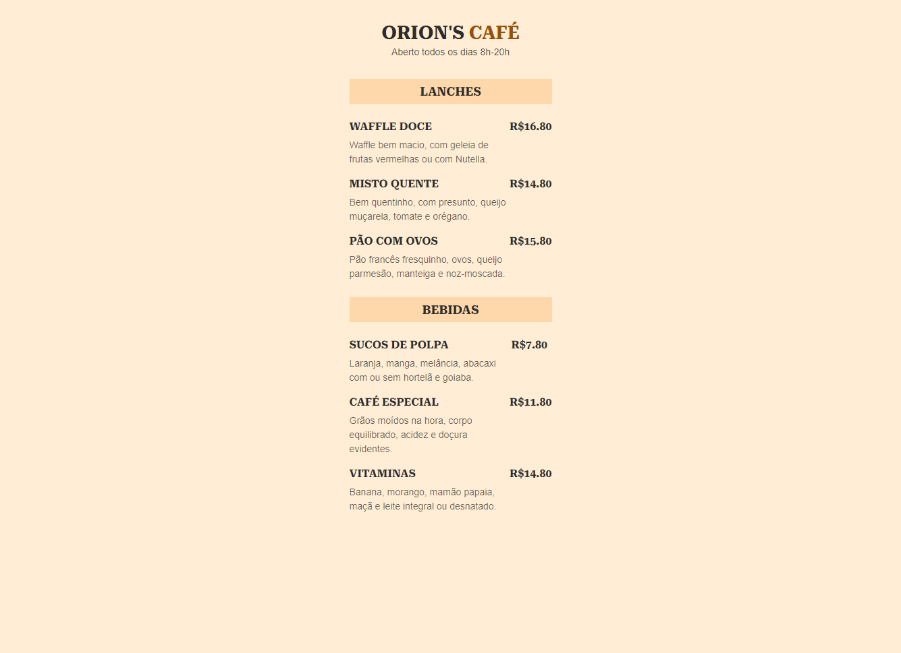

# RocketCoffee

Cardápio online com QR Code

  

Maratona explorer da [Rocketseat](https://github.com/Rocketseat) com o Professor [Mayk Brito](https://github.com/maykbrito)👩‍💻 
- Aula 01 : Fundamentos  da programação + HTML 
- Aula 02 : CSS  
- Aula 03 : VS Code + Github + Netlify + Geradores de QRCode  
 
